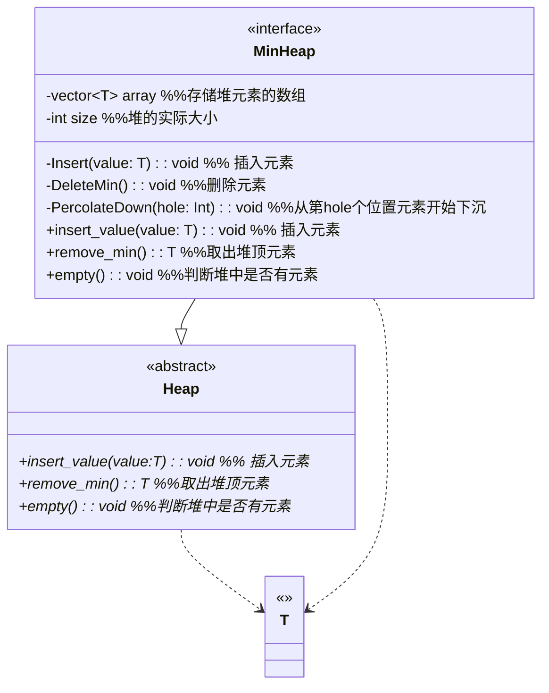
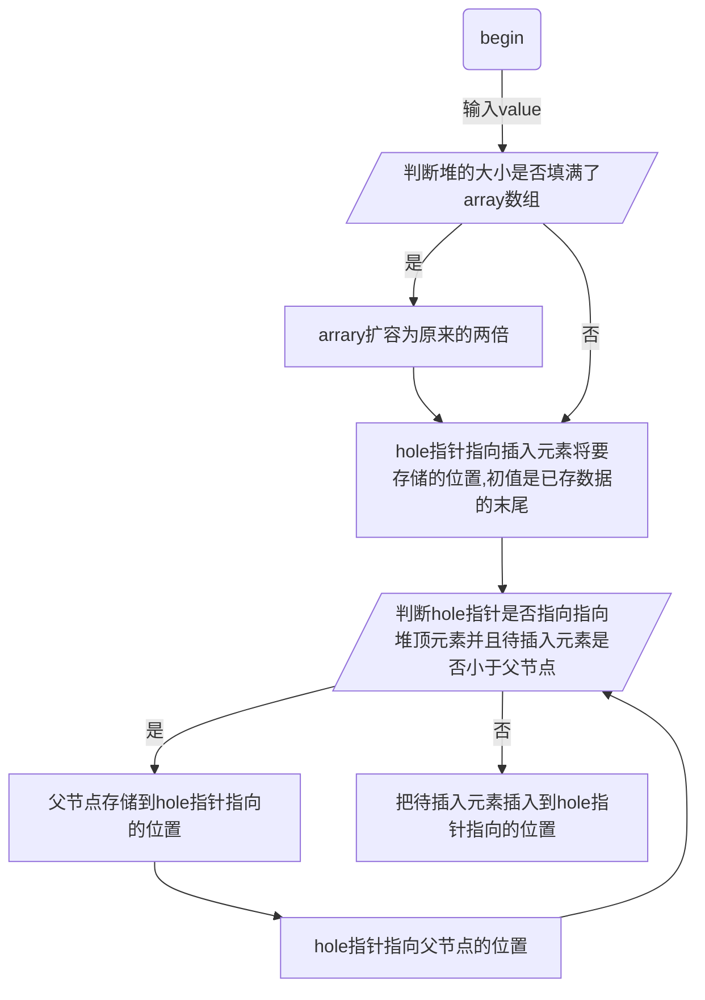
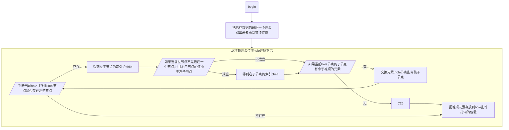

最小堆
## 类UML图

## 插入元素函数Insert流程图
先放到末尾，再依次与父节点比较，逐渐上浮！！！

## 删除堆顶元素函数DeleteMin流程图
把最后一个元素放到开头，依次比较进行沉降！！！

## 注意
1. array数组初始化的第一个元素，不存放数
2. 由于第一个位置不存放元素, 
   1. 因此数组第i个位置的父节点是 i/2;
   2. 数组第i个位置的子节点是 2i, 2i+1
